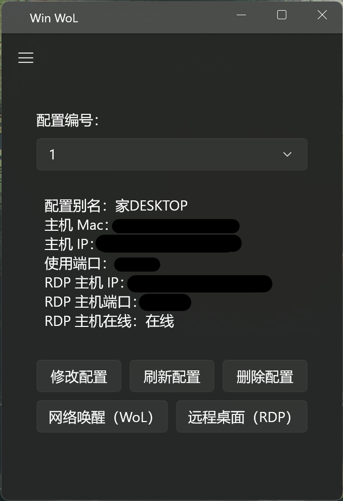
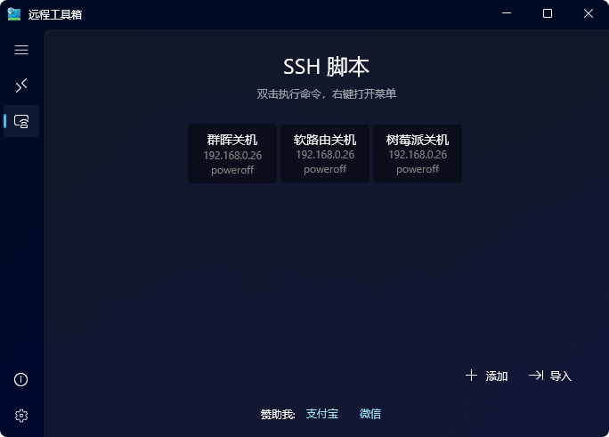

<p align="center">
  <h1 align="center">远程工具箱 (Remote Toolbox)</h1>
  <p align="center">一个基于 WinUI3 的远程工具箱 (Remote Toolbox)。</p>
  <p align="center">
    <a href="https://github.com/SIXiaolong1117/WinWoL/blob/master/LICENSE">
      
    </a>
    <a href="https://github.com/SIXiaolong1117/WinWoL/releases">
      
    </a>
  </p>
  <p align="center">
    <a href="https://twitter.com/SI_Xiaolong">
      
    </a>
  </p>
</p>
<p align="center">
    
    
</p>

## ⬇下载/Download

### 从 Microsoft Store 获取（推荐）

[](https://www.microsoft.com/store/apps/9P5ZTP14LQBR)

### 从 Releases 获取自签名版（不推荐）

*我已不再继续更新自签名版本*

## ✋使用教程/Wiki

参考本项目[Wiki](https://about.sixiaolong.win/Project/Remote-Toolbox.html)。

## 🛠️获取源码/Source Code

要构建此项目，您需要将项目源码克隆到本地。

您可以使用 Git 命令行：

```powershell
git clone https://github.com/SIXiaolong1117/WinWoL.git
```

或者更方便的，使用 Visual Studio 的“克隆存储库”克隆本仓库。

使用 Visual Studio 打开项目根目录的 `WinWoL.sln`，即可进行调试和打包。
